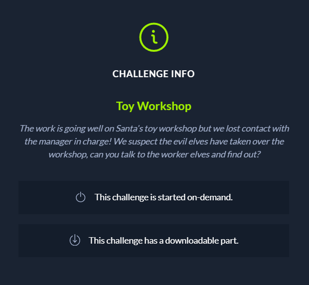
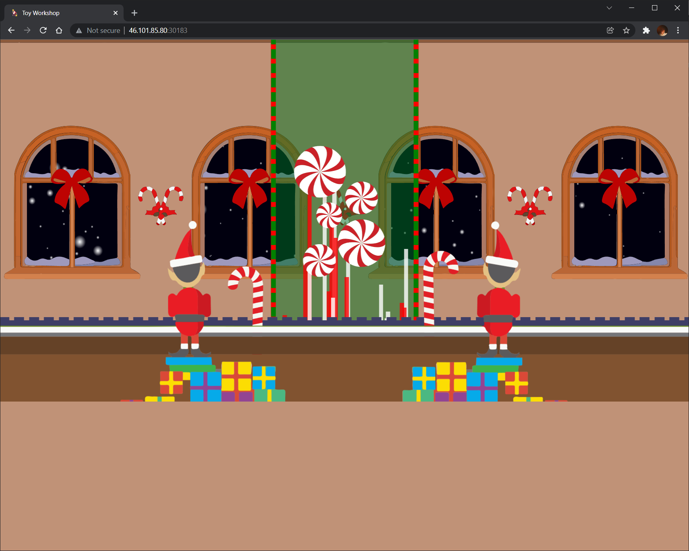
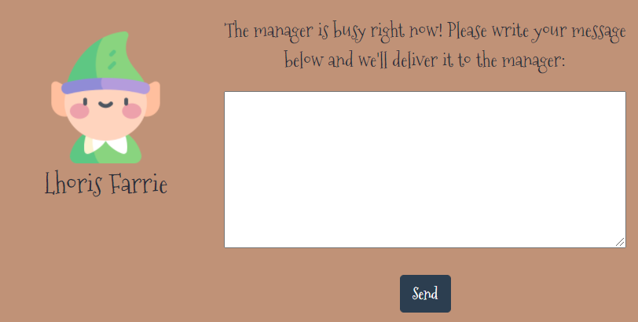
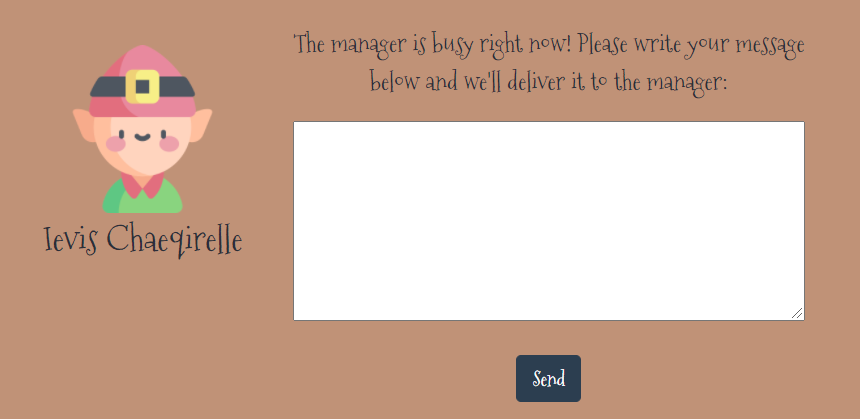
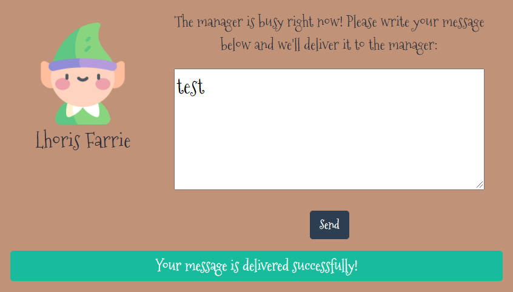
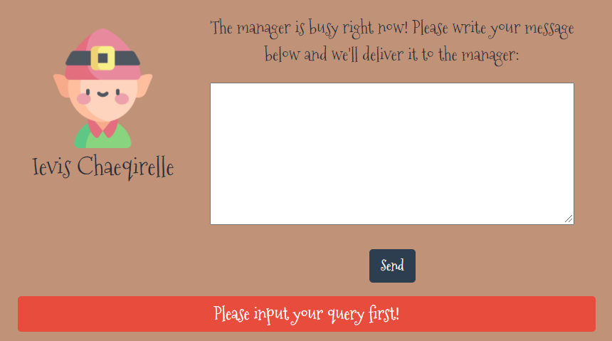

#### CHALLENGE DESCRIPTION

Points: 300

Difficulty: 1/4

Downloaded File(s): [web_toy_workshop](src\web_toy_workshop)

---

#### SOLUTION

<u>Step 1a: Gather Information about the Web page provided</u>

After starting the docker provided, we are able to access the URL.



Clicking on the elves' head will result in a pop-up text box. The left elf is named Lhoris Farrie and right elf is named Ievis Chaeqirelle:

 

Submitting a message allows us to deliver a message:



Submitting an empty message result in the following:



There doesn't seem to be other interactions.


<u>Step 1b: Gather information about the file provided</u>

The file provided should typically be the source file for the web application. We should carefully inspect it to understand how the application works.

```
web_toy_workshop
∟ challenge
	∟ routes
		∟ index.js
	∟ static
		∟ audio
			∟ audio.mp3
		∟ css
			∟ bootstrap.min.css
			∟ dashboard.css
			∟ index.css
			∟ remodal.css
			∟ remodal-default-theme.css
		∟ images
			∟ ballset.png
			∟ bearset.png
			∟ bin2.png
			∟ cflower.png
			∟ elf1.png
			∟ elf2.png
			∟ gameset.png
			∟ logo.png
			∟ santa-loading.gif
			∟ sign_post.png
			∟ trainset.png
		∟ js
			∟ bootstrap.min.js
			∟ conveyor.js
			∟ index.js
			∟ jquery-3.6.0.min.js
			∟ remodal.min.js
	∟ views
		∟ index.hbs
		∟ queries.hbs
	∟ bot.js
	∟ database.js
	∟ index.js
	∟ package.json
∟ config
	∟ supervisord.conf
∟ build-docker.sh
∟ Dockerfile
```

There are many files provided. However, since this is a CTF, our focus should be in the [challenge](src\web_toy_workshop\challenge) directory. Note that in the real world, finding malicious code/files are not as straight forward and requires more information gathering.


Flag:

```
CTF{}
```

---

#### References

